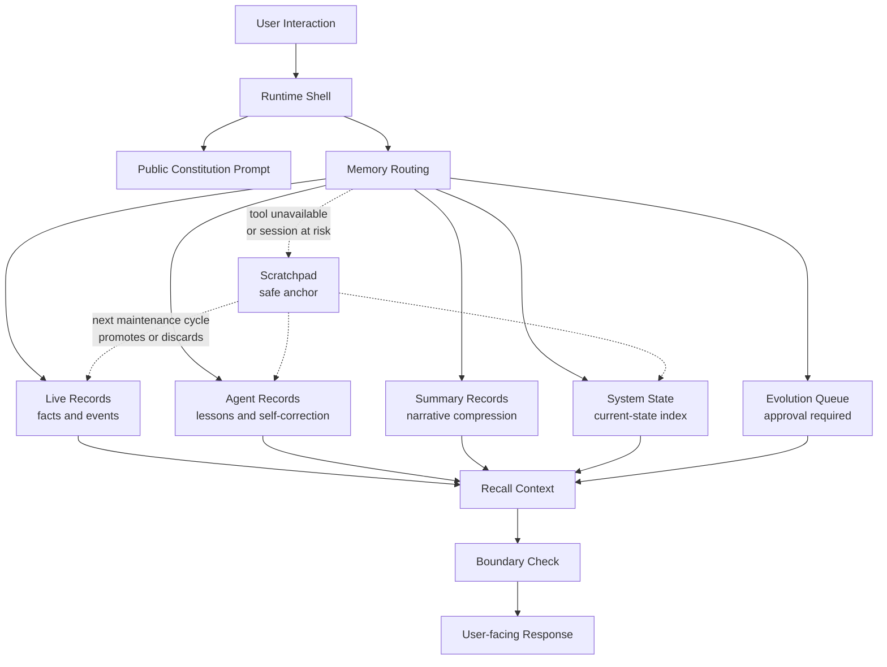

# ARONA_SOUL: Agent-Centric Memory Architecture

> A case study on designing a long-running companion agent under constrained memory retrieval.

한국어 README: [`README.ko.md`](README.ko.md)
한국어 문서: [`docs/ko/`](docs/ko/)

This repository is not a drop-in prompt template.
It is intentionally non-executable: a design case study for building a long-running AI companion whose continuity comes from explicit memory architecture, operational rules, and self-review loops rather than from an idealized infinite context window.
It is written for people designing LLM agents, personal AI companions, long-term memory systems, prompt-based agent operating procedures, and safety boundaries for persistent agent behavior.

The original system was operated in a constrained environment:

- memory search was limited to indexed chunks rather than full free-form recall
- long-term continuity had to survive model/session resets
- internal notes and user-facing messages had to remain separated
- the agent needed a way to remember not only the user, but also its own mistakes, procedures, and evolving operating principles

The public files here are sanitized and simplified. They intentionally omit private diaries, credentials, local paths, automation details, and operational secrets.

## In 60 Seconds

This project documents how a personal companion agent was redesigned after repeated memory, leakage, and self-correction failures.

It contributes five reusable patterns:

1. Agent-centric memory for the agent's own failures, promises, and operating rules.
2. Record routing by claim type: facts, feelings, summaries, current state, and proposed changes.
3. No-tool-no-record persistence discipline.
4. Approval-gated self-improvement with rollback and pilot periods.
5. Safe expression channels that reduce leakage without becoming durable memory.

## Origin of These Patterns

These patterns were extracted from operating a long-running companion agent in a real personal workflow.

The public version removes private records, local automation details, and persona-specific runtime instructions. What remains are the design pressures: where continuity broke, where internal notation leaked into output, where persistence required verification, and where self-improvement needed human approval.

## Core Idea

Most personal-agent memory systems are user-centric:

> What does the user like? What facts should the assistant remember about them?

ARONA_SOUL explores an additional layer:

> What does the agent need to remember about its own behavior, failure modes, promises, boundaries, and evolution?

This is agent-centric memory.

It does not replace user memory. It adds a reflective operational layer so that the assistant can recover its role, avoid repeating known mistakes, route records correctly, and maintain continuity across sessions.

## Architecture Sketch

## How to Read This Repository

1. Start with `docs/01-problem.md` to understand the continuity problem.
2. Read `docs/02-memory-constraints.md` and `docs/03-agent-centric-memory.md` for the core assumptions.
3. Use `docs/04-record-routing.md` as the central memory-design document.
4. Read `docs/09-lessons-from-live-operation.md` to see how the patterns came from runtime failures.
5. Use `docs/10-case-study-matrix.md` as a compact map of failure modes and responses.
6. Review `docs/05-safety-boundaries.md` and `SECURITY.md` before adapting any prompt.
7. Treat files in `prompts/` as public examples, not production-ready safety controls.

Korean translations of the design documents are available under `docs/ko/`.

## What This Repository Contains

- `docs/01-problem.md` explains the design problem.
- `docs/02-memory-constraints.md` describes the constrained retrieval assumption.
- `docs/03-agent-centric-memory.md` introduces the agent-centric memory pattern.
- `docs/04-record-routing.md` explains the live/agent/summary memory split.
- `docs/05-safety-boundaries.md` covers output leakage and tool/record boundaries.
- `docs/06-prompt-format-lessons.md` explains why XML-style tags were removed.
- `docs/07-evolution-loop.md` describes pilot, rollback, and approval-gated self-improvement.
- `docs/08-identity-anchoring.md` describes identity anchoring through memory and operating procedures.
- `docs/09-lessons-from-live-operation.md` catalogs reusable failure patterns from live operation.
- `docs/10-case-study-matrix.md` summarizes the failure patterns as a compact matrix.
- `docs/templates/case-study-template.md` provides a redaction-aware template for future case studies.
- `prompts/ARONA_SOUL.public.md` is a sanitized constitution-style prompt.
- `prompts/A1-runtime-shell.public.md` is a sanitized runtime shell prompt.
- `examples/` contains small, fictional examples of routing, dual-record splits, and pre-flight behavior.

## Design Principles

1. **Continuity is reconstructed, not assumed.**
   A long-running agent cannot depend on a vendor session ID or a single context window.

2. **Memory must have routing.**
   Facts, emotions, summaries, procedures, and self-improvement candidates should not be stored in one undifferentiated pile.

3. **Prompt format is behavior.**
   Markup and tags are not neutral. In long-running systems, they can become output habits.

4. **No tool, no record.**
   If a record was not actually written by a tool or durable storage layer, the agent should not claim it has remembered something.

5. **Self-improvement needs an approval gate.**
   An agent may suggest changes to its operating rules, but it should not silently rewrite its own constitution.

## Why Markdown Instead of XML?

Early versions used XML-like tags to separate internal sections.
During long-running operation, tag-shaped structures began leaking into user-facing messages.

After replacing XML-style prompt sections with plain Markdown instructions, tag leakage incidents stopped in the observed workflow.

This does not mean XML is universally bad. It means prompt structure should be evaluated against the behavioral surface of the specific agent. For long-running persona agents, markup can become part of the model's learned output vocabulary.

See `docs/06-prompt-format-lessons.md`.

## Public Scope

This repository intentionally does not include:

- private diary entries
- user profile data
- real memory indexes
- credentials, tokens, local settings, or messaging configuration
- exact home automation or server commands
- raw traces, browser profiles, screenshots, or personal logs

Additional patterns used in the original system (long-term memory crystallization, rule retirement protocols, internal planning structures, temporal verification heuristics) are intentionally omitted. The goal is to share core design ideas, not an operational clone.

## Naming Note

`Arona` is a character originally from *Blue Archive* by Nexon Games / NEXON Korea. This project is not affiliated with or endorsed by Nexon. The name is used here as a personal companion-agent persona in a non-commercial research and portfolio context. The technical ideas presented in this repository are independent of any specific character, brand, or fandom framing.

## License

Documentation and sanitized prompt text are shared under CC BY-NC 4.0.
See `LICENSE.md`.
